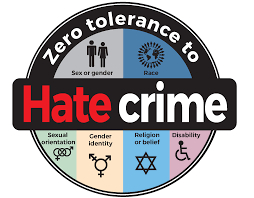

# Hate Crime Data Mining (2017–2025)

 <!-- Replace with correct path or GitLab-hosted image URL -->

## 📊 Overview

This project focuses on mining patterns from a dataset of hate crimes in the United States between 2017 and 2025. By applying advanced data mining and machine learning techniques, it aims to uncover trends, classify incidents, cluster similar crimes, and extract meaningful associations to support public safety awareness and policy-making.

---

## 🧱 Project Structure

- `notebooks/`: Jupyter notebooks with data analysis
  - `hate-crime.ipynb`: Main analysis notebook with data mining and machine learning techniques
- `hate-crime_2017-2025.csv`: Raw dataset file
- `requirements.txt`: Python dependencies for data analysis and machine learning
- `Dockerfile`: Container configuration for reproducible analysis
- `hate-crime.png`: Project logo

---

## 🧠 Methods Planned to be Used

- Exploratory Data Analysis (EDA)
- Feature Engineering
- Clustering (K-Means, DBSCAN)
- Classification (Random Forest, XGBoost)
- Association Rule Mining (Apriori, FP-Growth)
- Time Series Analysis
- Geospatial Visualization (Folium, GeoPandas)

---

## 🔧 Setup Instructions

### Using pip

```bash
# Clone the repository
git clone [repository-url]
cd hate-crime-data-mining

# Create and activate virtual environment (optional)
python -m venv venv
source venv/bin/activate  # On Windows: venv\Scripts\activate

# Install dependencies
pip install -r requirements.txt

# Launch Jupyter notebook
jupyter notebook notebooks/hate-crime.ipynb
```

### Using Docker

```bash
# Build and run Docker container
docker build -t hate-crime-analysis .
docker run -p 8888:8888 hate-crime-analysis
```

Then open the provided URL in your browser to access the Jupyter notebook.

## ✅ Current Status

| Component           | Status      |
| ------------------- | ----------- |
| Prepare Dataset     | ✅ Done     |
| Data Cleaning       | ✅ Done     |
| EDA                 | ✅ Done     |
| Feature Engineering | ✅ Done     |
| Clustering          | ✅ Done     |
| Classification      | ✅ Done     |
| Association Rules   | ✅ Done     |
| Geospatial Analysis | ✅ Done     |
| Final Report        | ✅ Done     |
| Presentation Slides | 🔄 Drafting |

---

## 📝 To-Do

- [x] Clean and preprocess data
- [x] Perform initial EDA
- [x] Create feature engineering pipeline
- [x] Implement clustering models and interpret results
- [x] Build classification models for bias prediction
- [x] Run association rule mining
- [x] Develop geospatial visualizations
- [x] Finalize visuals for report
- [x] Write full project report in PDF
- [ ] Prepare presentation slides

---

## 🔍 Dataset Source & Key Findings

- The dataset was compiled from official hate crime reports covering the years 2017–2025.
- Contains fields such as `Date of Incident`, `Bias`, `Offense(s)`, `Location`, `Victim Demographics`, etc.
- Analysis in `hate-crime.ipynb` reveals that the most common bias types are Anti-Black/African American, Anti-Gay (Male), and Anti-Jewish
- Key findings include:
  - Distinctive clusters of hate crime incidents based on victim and offender demographics
  - Strong temporal patterns showing fluctuations in specific bias types over time with clear seasonal components
  - Machine learning models can predict racial bias motivation with over 75% accuracy
  - Association rules reveal significant co-occurrence patterns between locations, offenses, and bias types
  - Geospatial analysis identifies hotspots that could benefit from targeted intervention
  - Network analysis demonstrates complex relationships between bias types and offense categories
  - Statistical tests confirm significant differences in victim counts across bias types
  - Interactive visualizations provide comprehensive insights for presentation and decision-making

---

## 📌 Project Topics (Tags)

`data-mining`, `machine-learning`, `clustering`, `classification`, `association-rules`, `hate-crime`, `data-analysis`, `pandas`, `scikit-learn`, `visualization`, `python`, `jupyter-notebook`, `crime-data`, `time-series`, `geospatial-analysis`

---

## 📜 License

This project is for educational and research purposes only.

---

## ✒️ Author

**[Efe Can Kara]**  
Data Mining Final Project | [Sivas Cumhuriyet University]  
Spring 2025
